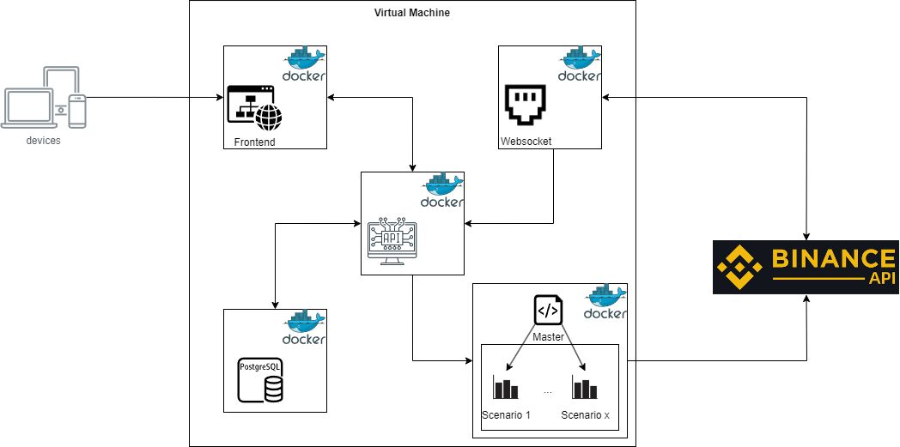

# Binance Trade Manager

## Description
Web application made to handle trades defined as scenarios.

## Architecture
<p align="center">
    
<p>

## Sitemap Diagram
<p align="center">
    
<p>

## System Design
<p align="center">
    
<p>

## Database Design
[dbdiagram](https://dbdiagram.io/d)
```
Table scenario {
  id int [pk, increment]
  pair varchar
  entry_amount float
  amount float
  date datetime
  is_over boolean
}

Table trade {
  id int [pk, increment]
  scenario_id int [ref: > scenario.id]
  name varchar
  date datetime
  buy_side boolean
  price float
  quantity float
  amount float
  fee float
}
```

## Links
[user-data-stream](https://github.com/binance/binance-spot-api-docs/blob/master/user-data-stream.md)